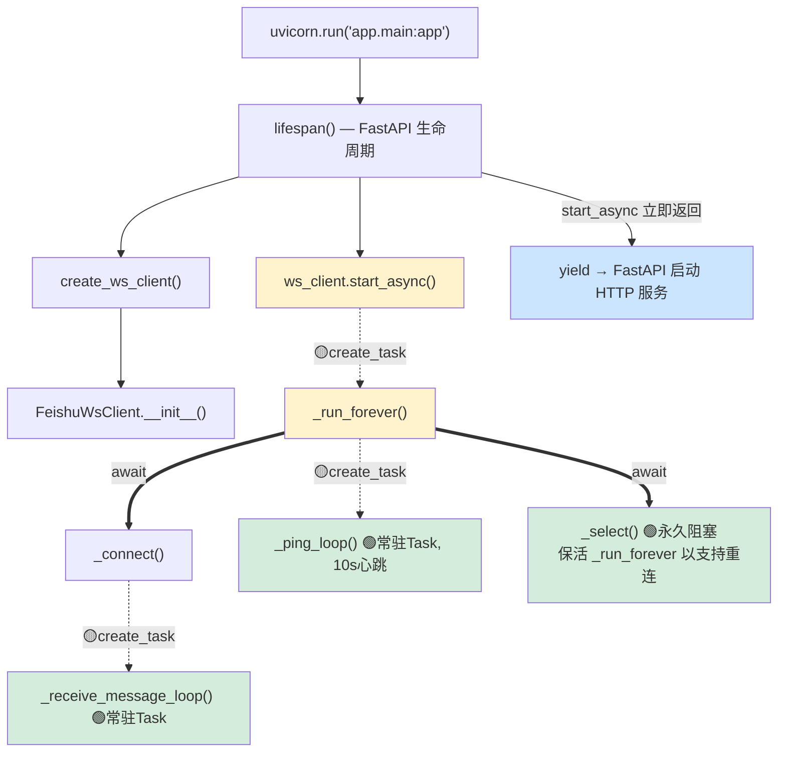
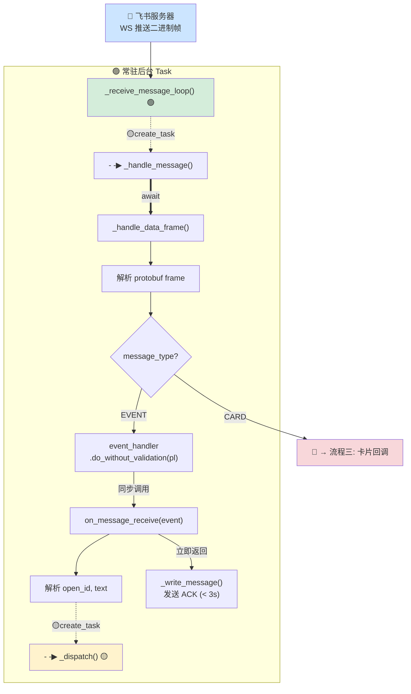
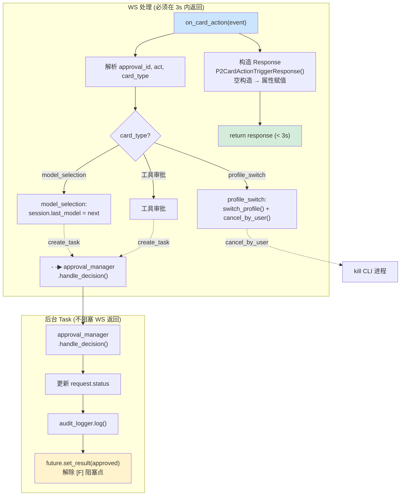
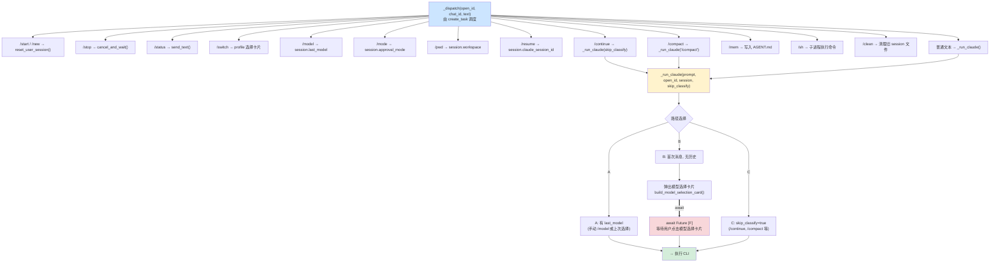
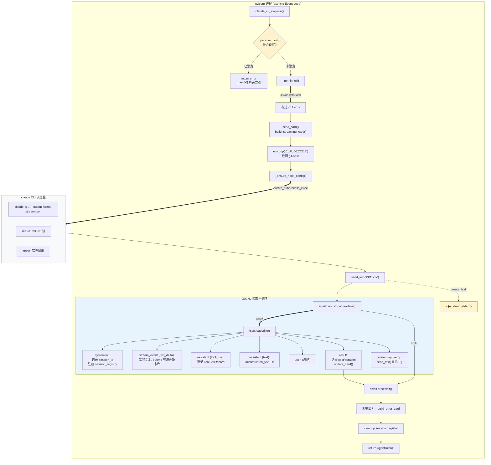
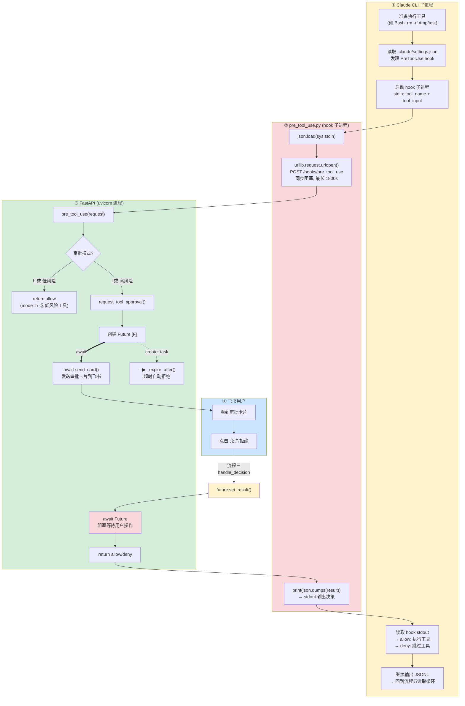
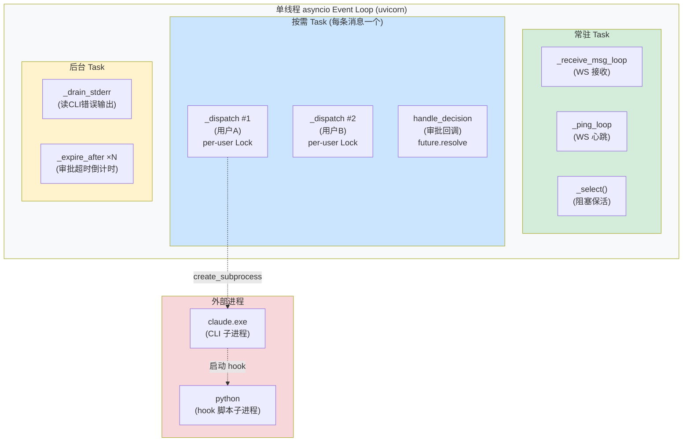

# OpenClaw 异步运行流程图 (Mermaid)

## 图例

### 箭头类型

| 箭头 | 含义 |
|------|------|
| `──▶` 实线 | 同步/直接调用 |
| `══▶` 粗线 | await（阻塞等待，调用者挂起直到完成） |
| `- -▶` 虚线 | create_task（异步委托，调用者立即继续） |

### 颜色编码

| 颜色 | 代码 | 含义 | 出现位置 |
|------|------|------|----------|
| 🔵 浅蓝 | `#cce5ff` | **飞书侧** — 飞书服务器、用户交互、消息发送 | 流程二、四、六、七、全链路 |
| 🟢 浅绿 | `#d4edda` | **常驻后台 Task** — WS 接收循环、心跳、卡片回调、审批 resolve | 流程一、二、三、七 |
| 🟡 浅黄 | `#fff3cd` | **异步委托 / create_task 起点** — 调度方、按需 Task | 流程一、二、三、四、五、七 |
| 🔴 浅红 | `#f8d7da` | **Hook 审批流程** — 跨进程审批、HTTP 回调、风险工具 | 流程二、四、六、七 |
| ⚪ 浅灰 | `#f8f9fa` | **Claude CLI 子进程** — 独立进程、不受 asyncio 管理 | 流程五、六、七 |
| 🟣 浅紫 | `#e8d5e7` | **子进程管理层** — cli_loop、per-user Lock | 流程五、全链路 |
| 🔴 亮红 | `#ff6b6b` | **Future 阻塞点 [F]** — await 挂起，等待外部 resolve | 流程四、六、全链路 |
| 🔵 极浅蓝 | `#e8f4fd` | **JSONL 事件解析区** — 读取主循环内部的事件分发 | 流程五 |

---

## 一、服务启动

> 🟡 黄 = create_task 起点 → 🟢 绿 = 常驻后台 Task → `await _select()` 保活重连容器

**`_select()` 保活解释：** `_receive_message_loop` 和 `_ping_loop` 已经是独立 Task，不需要 `_select()` 来维持。但 `_run_forever` 是重连的兜底容器（`try/except → _reconnect`），如果它 return 了，重连机制就失效。所以 `_select()` 把 `_run_forever` 钉在 `try` 块里。

---

## 二、消息接收流

> 🔵 蓝 = 飞书侧 → 🟢 绿 = 常驻 Task → 🟡 黄 = create_task 起点 → 🔴 红 = 转入卡片流程

---

## 三、卡片回调流

> 🟢 绿 = WS 快速返回 → 🟡 黄 = create_task 后台处理 → 🔵 蓝 = 飞书回调

---

## 四、命令分发流

> 🟡 黄 = create_task 起点 → 🔴 红 = 模型选择卡片 → 🟢 绿 = 最终执行

---

## 五、CLI 子进程执行流

> 🟣 紫 = 子进程管理 → ⚪ 灰 = Claude CLI 子进程 → 🔵极浅蓝 = JSONL 事件解析

**事件流：
---

## 六、工具审批流（跨三进程）

> 🟡 黄 = Claude CLI 子进程 → 🔴 红 = Hook 审批 → 🟢 绿 = FastAPI → 🔵 蓝 = 飞书用户

---

## 七、并发模型总览

> 🟢 绿 = 常驻 → 🔵 蓝 = 按需 → 🟡 黄 = 后台 → 🔴 红 = 外部进程

---

## 全链路总览 (一图流)

> 🔵蓝=飞书 → 🟢绿=WS → 🟡黄=分发 → 🟣紫=子进程管理 → ⚪灰=Claude CLI → 🔴红=Hook → 亮红=Future

```mermaid
flowchart LR
    subgraph feishu["飞书"]
        user["用户消息"]
        card_btn["卡片按钮"]
    end

    subgraph ws["WebSocket"]
        recv["on_message_receive"]
        card_action["on_card_action"]
    end

    subgraph dispatch["分发"]
        cmd_router["_dispatch"]
        run_claude["_run_claude"]
        model_card["模型选择卡片"]
    end

    subgraph cli_loop["子进程管理"]
        lock["per-user Lock"]
        spawn["create_subprocess_exec"]
        jsonl_read["readline JSONL"]
    end

    subgraph claude["Claude CLI"]
        execute["执行任务"]
        hook_trigger["触发 PreToolUse hook"]
    end

    subgraph hook["Hook 审批"]
        hook_script["pre_tool_use.py"]
        http_post["POST /hooks/pre_tool_use"]
        approval["approval_manager"]
        future["Future [F]"]
    end

    subgraph profiles["Profile 切换"]
        switch["/switch"]
        profile_card["profile 选择卡片"]
        copy_settings["copy settings_*.json"]
    end

    user -->|"WS 推送"| recv
    recv -.->|"create_task"| cmd_router
    cmd_router --> run_claude
    run_claude -->|"首次消息"| model_card
    model_card -->|"用户选择"| run_claude
    run_claude --> lock
    lock --> spawn
    spawn --> jsonl_read
    jsonl_read --> execute
    execute --> hook_trigger
    hook_trigger --> hook_script
    hook_script -->|"HTTP"| http_post
    http_post --> approval
    approval --> future
    future -->|"send_card"| card_btn
    card_btn -->|"WS 推送"| card_action
    card_action -.->|"create_task"| resolve["future.resolve"]
    resolve --> future
    future --> hook_script
    hook_script --> execute
    execute --> jsonl_read

    switch --> profile_card
    profile_card --> copy_settings
    copy_settings -->|"cancel_by_user"| lock

    style feishu fill:#cce5ff
    style ws fill:#d4edda
    style dispatch fill:#fff3cd
    style cli_loop fill:#e8d5f5
    style claude fill:#f8f9fa
    style hook fill:#f8d7da
    style future fill:#ff6b6b,color:#fff
    style profiles fill:#e8d5e7
```

